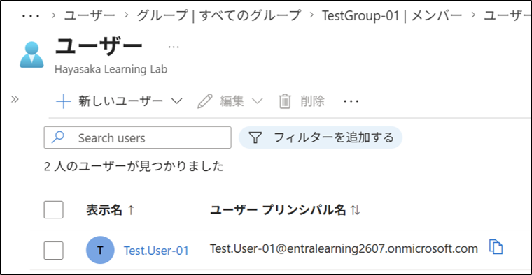
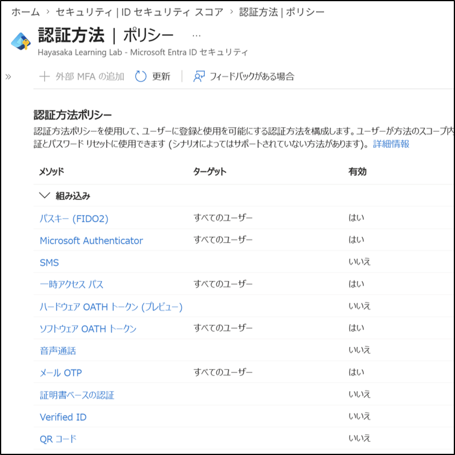
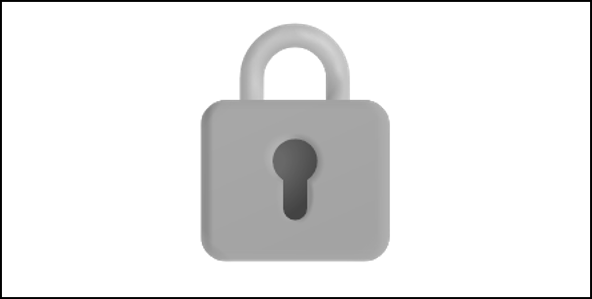
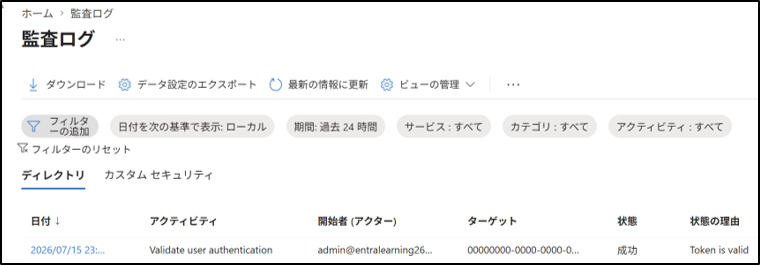
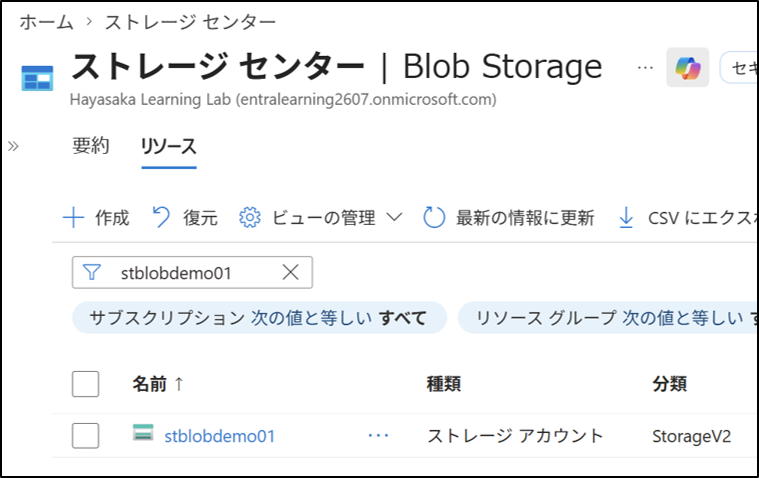

# 技術PR

## 目指すキャリア
- クラウドの保守運用領域でキャリアを開始する。
- ID管理、セキュリティ、ガバナンス領域へ拡大する。

<!-- 
## やりたいこと
- 常に新しいことを学び、自分や周囲の業務を改善する。
- クラウドのキャリアを積みリモートワークを実現し、仕事と家庭を両立する。
-->

## 経歴
- ソフトのオペレーションマニュアル(数百ページ)を作成し、判りやすい資料作成の方法を習得した。
- チームリーダーを６年間経験し、人との接し方、情報共有の仕方を習得した。
- これらの経験は、ドキュメント作成および、IT業務でのチームワークに活かせると考えている。

## 資格
- 基本情報技術者 / 情報セキュリティマネジメント
- AZ-900 (Azure Fundamentals)
- DP-900 (Azure Data Fundamentals)
- AI-900 (Azure AI Fundamentals)
- PL-900 (Power Platform Fundamentals)
- （学習中）AZ-104 (Azure Administrator)

##  学習ログ
### Entra ID（ID管理）
- [ユーザー管理・グループ管理・ロール管理](portfolio/01-01-entra-id.md)

- [MFA（認証方法ポリシー）](portfolio/01-02-mfa-authentication-policy.md)

- [条件付きアクセス（MFA 要求）]ライセンスが必要なため保留<!--(portfolio/01-03-entra-ca.md)-->

- [SSPR（Self-Service Password Reset）](portfolio/01-04-sspr.md)

- [監査ログ](portfolio/01-05-entra-audit-log.md)

### 基盤（VM / Storage / Virtual Network）
- [VM 作成（Windows/Linux）]有償のため保留 <!--(portfolio/02-01-vm-create.md)-->

- [NSG / パブリックIP]有償のため保留 <!-- (portfolio/02-02-nsg-public-ip.md)-->

- [Storage アカウント（Blob）](portfolio/02-03-storage-blob.md)

#### このページは、GitHub、VSCode、Markdownを使用して作成しました。

### 以下作成中
---

- [VNet / サブネット構成] <!--(portfolio/02-04-vnet-subnet.md)-->

### 監視（Azure Monitor）
- [メトリック監視（VM / Storage / Network）] <!--(portfolio/03-01-monitor-metrics.md)-->
- [アラートルール作成] <!--(portfolio/03-02-monitor-alert-rule.md)-->
- [Log Analytics ワークスペース] <!--(portfolio/03-03-monitor-log-analytics.md)-->
- [KQL クエリ（基本）] <!--(portfolio/03-04-monitor-kql-basic.md)-->

### ガバナンス（Azure Policy）
- [Policy 割り当て] <!--(portfolio/04-01-policy-assignment.md)-->
- [Compliance の確認] <!--(portfolio/04-02-policy-compliance.md)-->
- [Initiative 作成] <!--(portfolio/04-03-policy-initiative.md)-->

### セキュリティ（Defender for Cloud）
- [Secure Score の確認] <!--(portfolio/05-01-defender-secure-score.md)-->
- [推奨事項の適用] <!--(portfolio/05-02-defender-recommendations.md)-->
- [アラート確認] <!--(portfolio/05-03-defender-alerts.md)-->