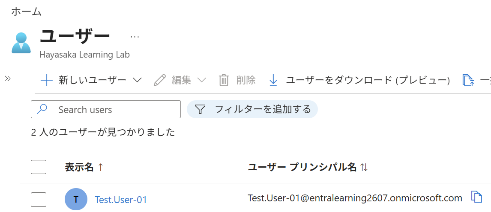

# 技術PR

## 目指すキャリア
- クラウドの保守運用領域でキャリアを開始する。
- ID管理、セキュリティ、ガバナンス領域へ拡大する。

## やりたいこと
- 常に新しいことを学び、自分や周囲の業務を改善する。
- クラウドのキャリアを積みリモートワークを実現し、仕事と家庭を両立する。

## 経歴
- ソフトのオペレーションマニュアル(数百ページ)を作成し、判りやすい資料作成の方法を習得した。
- チームリーダーを６年間経験し、人との接し方、情報共有の仕方を習得した。
- これらの経験は、ドキュメント作成および、IT業務でのチームワークに活かせると考えている。

## 資格
- 基本情報技術者 / 情報セキュリティマネジメント
- AZ-900 (Azure Fundamentals)
- DP-900 (Azure Data Fundamentals)
- AI-900 (Azure AI Fundamentals)
- PL-900 (Power Platform Fundamentals)
- （学習中）AZ-104 (Azure Administrator)

##  学習ログ
### Entra ID（ID管理）
- ユーザー管理、グループ管理、ロール管理

- MFA / 条件付きアクセス  
- SSPR  
- ログ監査  

### 監視（Azure Monitor / Log Analytics）
- メトリック監視（VM / Storage / Network）  
- アラートルール作成  
- Log Analytics ワークスペース  
- KQL クエリ（基本）  

### 基盤（VM / Storage / Virtual Network）
- VM 作成（Windows/Linux）  
- NSG / パブリックIP  
- Storage アカウント（Blob）  
- VNet / サブネット構成  

### ガバナンス（Azure Policy）
- Policy 割り当て  
- Compliance の確認  
- Initiative 作成  

### セキュリティ（Defender for Cloud）
- Secure Score の確認  
- 推奨事項の適用  
- アラート確認  

### このページは、GitHub、VSCode、Markdownを使用して作成しました。

