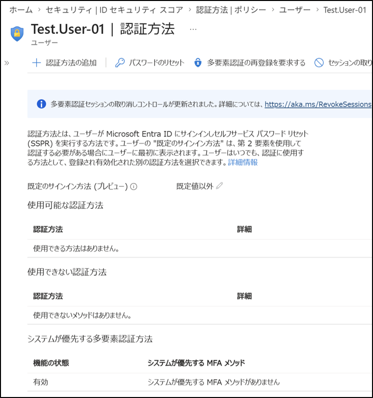

# **Entra ID：MFA（認証方法ポリシー)**

## 1. 目的  
Entra ID の新しい UI では「セキュリティの既定値（Security defaults）」が廃止されている。  
そのため、**認証方法ポリシーを使用して MFA を強制する構成**を理解し、  
安全な認証基盤を構築することを目的とする。

## 2. 設計
- 対象ユーザー：Test.User-01  
- MFA 強制方式：認証方法ポリシー（新 UI 標準）  
- 認証方法の構成：  
  - Microsoft Authenticator：**はい（必須）**  
  - SMS：**いいえ（無効）**  
  - 音声通話：**いいえ（無効）**  
  - パスキー（FIDO2）：**はい（推奨）**  
  - 一時アクセスパス：**はい（緊急用）**  
  - メール OTP：**はい（補助的）**

## 3. 手順（How）

### 認証方法ポリシーを確認する  
1. Entra 管理センターへアクセス  
2. 左メニュー → **認証方法**  
3. 各認証方法の有効／無効を確認する  
   - Microsoft Authenticator → **はい**  
   - SMS → **いいえ**  
   - 音声通話 → **いいえ**  
   - パスキー → **はい**  
   - 一時アクセスパス → **はい**

### ユーザーの認証方法を確認する  
1. 左メニュー → **ユーザー**  
2. Test.User-01 を選択  
3. 上部タブ → **認証方法**  
4. 「使用できる方法はありません」と表示される  
   → これは **ユーザーがまだ MFA を登録していない正常な状態**  
   → 次回ログイン時に Authenticator の登録が必須になる

## 4. 結果
- Microsoft Authenticator を必須に設定。
  このテナントではパスワードだけではログインできません。
  Test.User-01 は次回ログイン時に Microsoft Authenticator の登録を求められ、登録が完了するまでログインはできません。
- 弱い認証方法（SMS / 電話）を無効化し、セキュリティを向上。
- パスキー（FIDO2）によりパスワードレス運用にも対応。

## 5. 学び
- 新 UI では Security defaults が廃止されている  
- 認証方法ポリシーが MFA 強制の中心機能となる  
- ユーザー画面が空でも問題なく、ログイン時に登録が求められる  
- Microsoft Authenticator を必須化することでゼロトラストの基礎が整う
