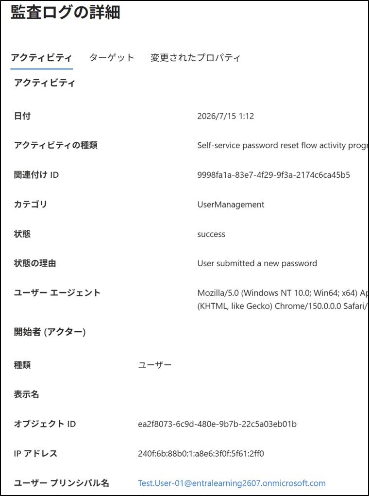
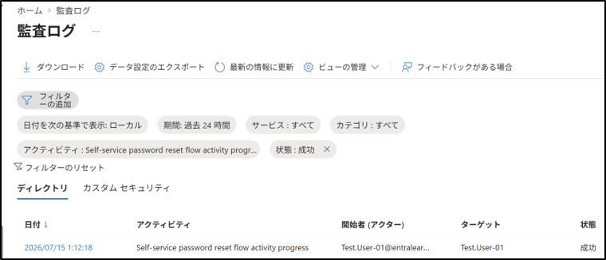

# **Entra ID：監査ログ（Audit Logs）**

## 1. 目的（Why）
Entra ID 内で発生した **すべての管理操作の証跡（Audit Logs）を確認し、  
「誰が・いつ・何をしたか」を追跡できる状態を作る。
監査ログはセキュリティ運用の基礎であり、  
ユーザー作成、グループ変更、ロール付与などの変更履歴を把握するために必須。

## 2. 設計（What）
- 対象：Microsoft Entra ID テナント  
- 取得するログ：Audit Logs（監査ログ）  
- 確認する主な項目  
  - Activity（操作名）  
  - Initiated by（実行者）  
  - Target（対象オブジェクト）  
  - Status（成功／失敗）  
  - Date（日時）  

## 3. 手順（How：GUI）
### 3-1. ログ一覧の確認
1. Entra 管理センター    
2. 左メニュー → **Entra ID → 監視と正常性 → 監査ログ**を選択 
- アクティビティ（Activity）  
- 開始者（Initiated by / Actor）  
- ターゲット（Target）  
- 状態（Status）  
- 状態の理由（Status reason）  
- 日付（Date）※固定項目  
これらの項目により、  
「誰が・いつ・何を・どこに・どうしたか」を一覧で把握できる。

### 3-2. ログ詳細の確認
1. 任意のログをクリック  
2. 右側に詳細パネルが表示  
3. 「変更内容」「対象オブジェクト」「実行者」「追加情報」を確認  

### 3-3. フィルターの利用
監査ログはフィルターで絞り込める：
- Category（カテゴリ）  
- Activity（操作名）  
- Status（成功／失敗）  
- Date（期間指定）  

## 4. 結果（Output）
- テナント内のすべての管理操作の履歴が確認できる  
- ユーザー作成／削除、グループ変更、ロール付与などの証跡が取得できる  
- セキュリティ監査や障害調査に利用できる  

## 5. 学び（Insight）
- Entra ID の操作はすべて監査ログに記録される  
- GUI で簡単に「誰が・いつ・何をしたか」を追跡できる  
- セキュリティ運用の基礎として、監査ログの確認は必須  
