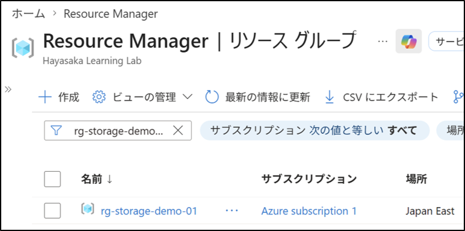
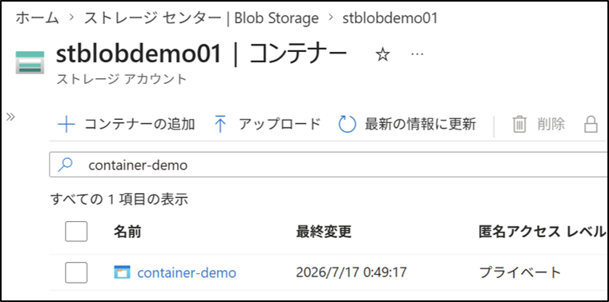
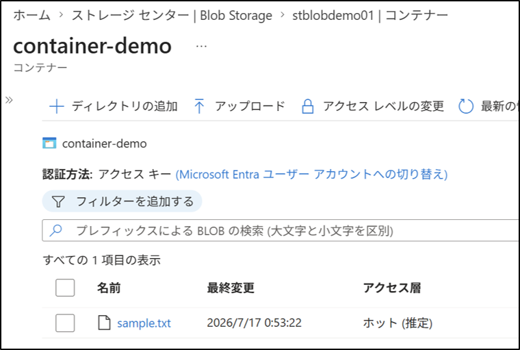
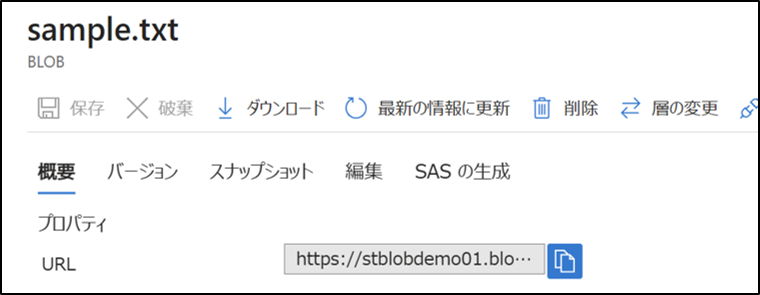

# Storage アカウント（Blob）

## 1. 目的
Azure Storage アカウントを作成し、Blob コンテナーの作成、Blob のアップロード、アクセス方法を理解する。

## 2. 設計（What）
- リソース グループ名：`rg-storage-demo-01`
- ストレージ アカウント名：`stblobdemo01`
- コンテナー名：`container-demo`
- Blob：`sample.txt`
- アクセスレベル：`非公開`
- 冗長性：`ローカル冗長ストレージ（LRS）`

## 3. 手順（How：GUI）

### 3-1. リソース グループの作成
1. Azure ポータルにサインインする。
2. 左メニュー → Resource Manager → リソース グループ
3. ＋作成 を押す。
4. 以下を設定する：
   - サブスクリプション：`Azure subscription 1`
   - リソース グループ名：`rg-storage-demo-01`
   - リージョン：`(Asia Pacific)Japan East`
5. レビューと作成 → 作成

### 3-2. ストレージ アカウントの作成
1. 左メニュー → ストレージ アカウント
2. ＋作成 を押す。※有料です。
3. 以下を設定する：
   - サブスクリプション：`Azure subscription 1`
   - リソース グループ：`rg-storage-demo-01`
   - ストレージ アカウント名：`stblobdemo01`
   （フィールドに使用できるのは、小文字と数字のみです。名前は 3 ～ 24 文字である必要があります。）
   - リージョン：`(Asia Pacific)Japan East`
   - プライマリサービス（優先ストレージの種類）：`Azure Blob Storage または Azure Data Lake Storage`
   - パフォーマンス：`Standard`
   - 冗長性：`LRS`
4. レビューと作成 → 作成

### 3-3. コンテナーの作成
1. 左メニュー → ストレージ アカウント
2. 作成したストレージ アカウントを開く。
2. 左メニュー → データストレージ → コンテナー
3. ＋コンテナーの作成 を押す。
4. 名前：`container-demo`
5. 匿名アクセスレベル：プライベート
6. 「作成」を押す。

### 3-4. Blob のアップロード
1. コンテナー `container-demo` を開く。
2. 「アップロード」を押す。
3. 任意のファイル（`sample.txt`）を選択する。
空のテキストファイルでよい
4. 「アップロード」を押す。

### 3-5. Blob のアクセス確認
1. アップロードした Blob を選択する。
2. 「URL」をコピーし、アクセスできるかを確認する。
（非公開コンテナーの場合、URLにアクセスしても表示されない。）
3. 必要に応じて「SAS の生成」でアクセス権を付与する。（今回は使用しない）
   - 開始時刻・終了時刻
   - 許可する操作（読み取りなど）
   - 生成された SAS URL を確認する
   - 「保存」を押す

## 4. 結果
- リソースグループが作成された。
- ストレージアカウントが作成された。
- コンテナーが作成された。
- Blob がアップロードされた。
- Blob のアクセス方法（URL と SAS）を理解した。

## 5. 学び
- ストレージアカウント → コンテナー → Blob の階層構造を理解した。
- 非公開コンテナーでは SAS を使ってアクセス権を付与する必要がある。
- Azure Storage のアクセス制御は「ネットワーク」「SAS」「RBAC」の 3 層で構成されていることを理解した。
