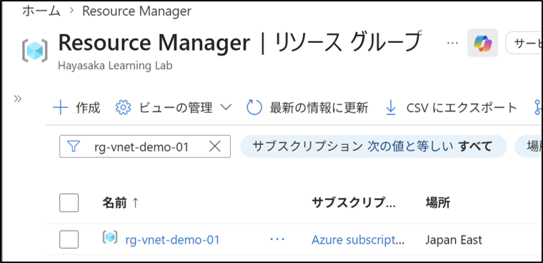
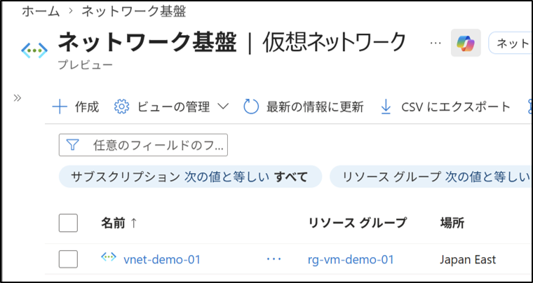
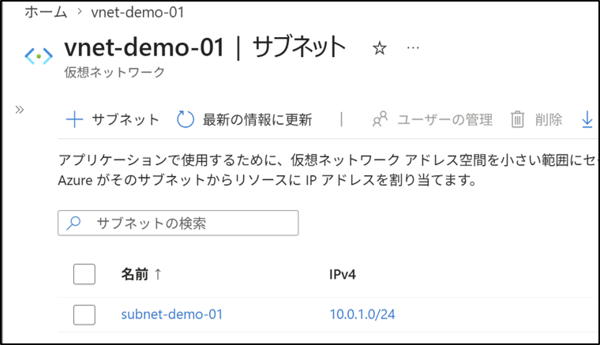
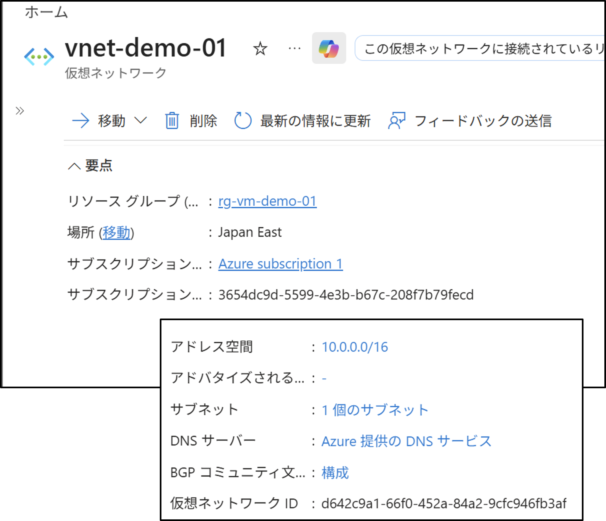
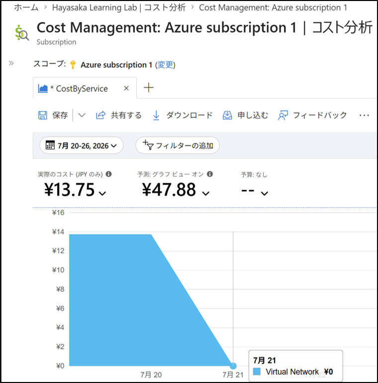

# Virtual Network（VNet）／サブネット構成（GUI）

## 1. 目的
Azure Portal を使用して、仮想ネットワーク（VNet）とサブネットを作成する手順を理解する。  

## 2. 設計
- リソース グループ：`rg-vnet-demo-01`
- 仮想ネットワーク名：`vnet-demo-01`
- アドレス空間：`10.0.0.0/16`
- サブネット名：`subnet-demo-01`
- サブネット範囲：`10.0.1.0/24`

## 3. 手順

### 3-1. リソース グループの作成
1. Azure ポータルへサインインする。
2. 左メニュー → リソース グループ
3. ＋ 作成 を押す。
4. 以下を設定する：
   - サブスクリプション：`Azure subscription 1`
   - リソース グループ名：`rg-vnet-demo-01`
   - リージョン：`(Asia Pacific) Japan East`
5. レビューおよび作成 → 作成

### 3-2. 仮想ネットワーク（VNet）の作成
1. 左メニュー → 仮想ネットワーク
2. ＋ 作成 を押す。
3. 基本情報 タブ：
   - リソース グループ：`rg-vnet-demo-01`
   - 仮想ネットワーク名：`vnet-demo-01`
   - リージョン：`(Asia Pacific) Japan East`
4. アドレス空間 タブ：
   - IPv4 アドレス空間が `10.0.0.0/16` になっていることを確認する。
   - defaultのサブネットが自動生成されている場合はゴミ箱マークをクリックして削除する。
   - ＋アドレス空間の追加 → IPv4 アドレス空間の追加
   - 保存を押す

### 3-3. サブネットの作成
   - ＋サブネット を押す。
     - サブネットの目的：Default
     - 名前：subnet-demo-01
     - 開始アドレス：10.0.1.0
     - サイズ：/24(256個のアドレス)
     - 追加をクリック。

### 3-4. ネットワーク構成の確認
1. 左メニュー → 仮想ネットワーク
2. 作成した仮想ネットワークを選択
3. 左メニュー → 概要
4. アドレス空間 `10.0.0.0/16` が設定されていることを確認する。
5. サブネット `subnet-demo-01` が存在することを確認する。

### 3-5. 課金対象リソースの確認
1. 左メニュー → コストの管理と請求
2. 左メニュー → コストの管理 → コスト分析
3. 細分性 → 日単位
4. 意図していない課金が発生していないかを確認する。

## 4. 結果
- リソース グループが作成された。
- 仮想ネットワーク（VNet）が作成された。
- サブネットが作成された。
- 意図していない課金が発生していないかを確認した。

## 5. 学び
- VNet → サブネット の階層構造を理解した。
- 仮想マシンがなくてもネットワーク単体で作成できることを確認した。
- ネットワーク構成は他サービス（VM / Storage / Private Endpoint）と連携して利用される。
