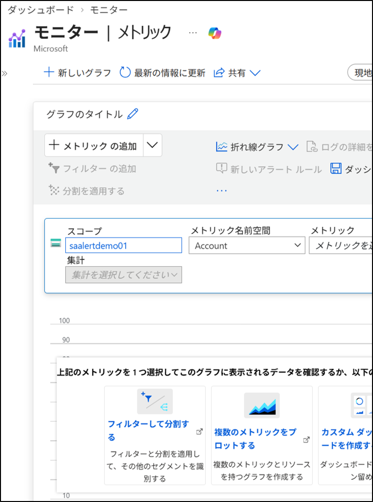
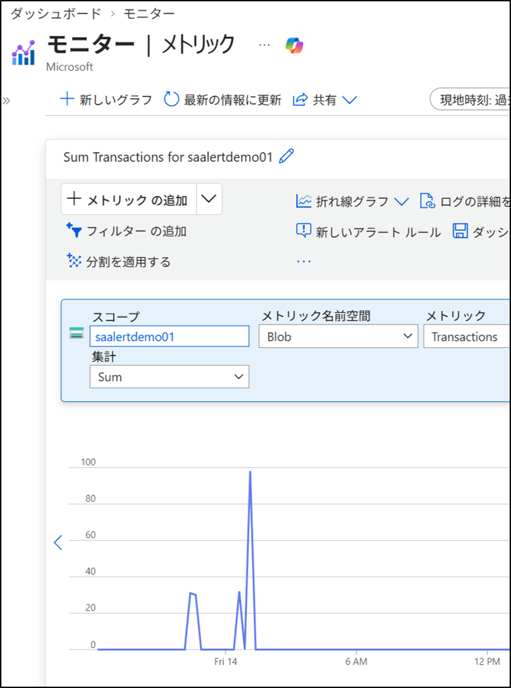
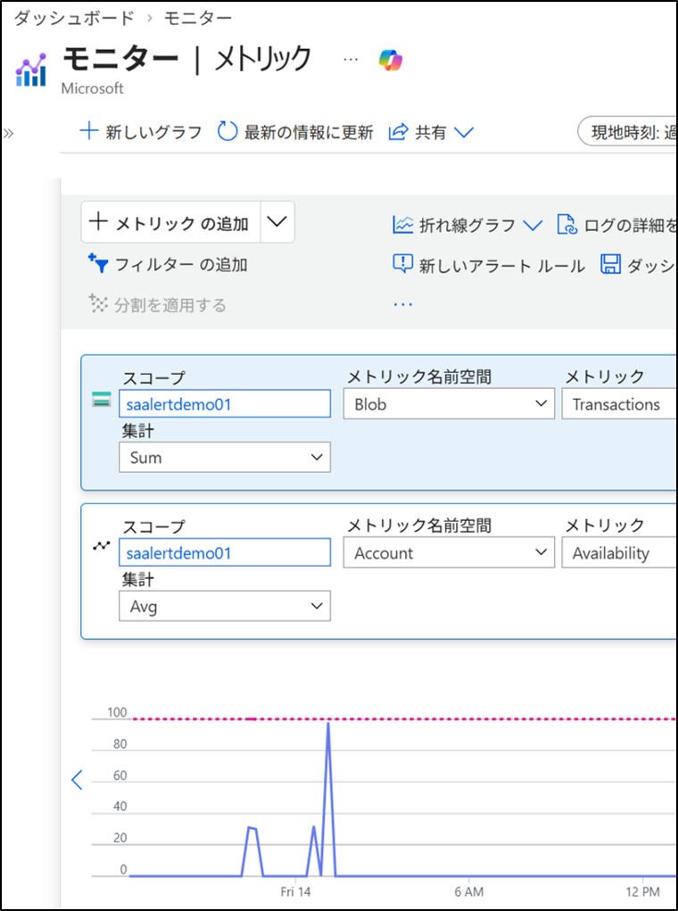
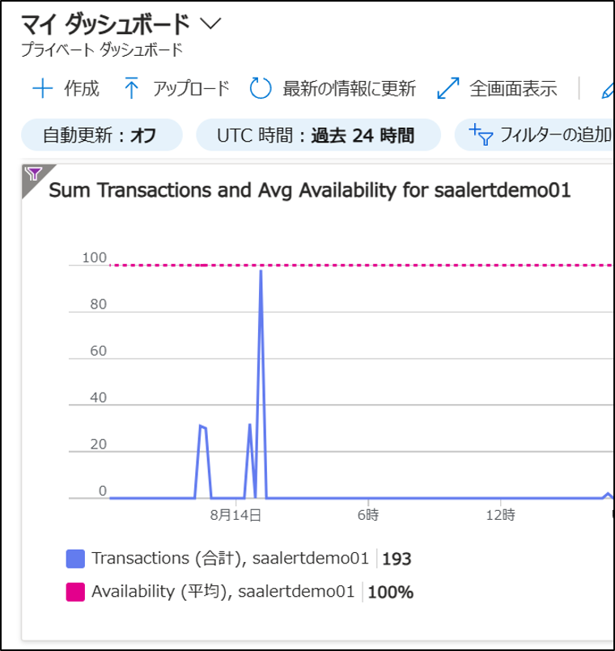

# Azure Monitor：メトリック監視（Storage）
**要点**  
Azure Storage のプラットフォームメトリックを用いて、  
要求数・レイテンシ・可用性などを時系列で把握する。

## 1. 目的
Storage アカウントの状態を数値（メトリック）で継続的に把握し、  
性能・安定性・エラー傾向を確認できるようにする。

## 2. 設計（Storage のみ）
### 2-1 対象リソース
- **Storage アカウント（Blob / Queue / Table / File）**
  - Total Requests
  - Success E2E Latency
  - Server Latency
  - Availability
  - Server Errors / Client Errors

本ページでは **監視対象を Storage アカウントに限定**し、以下の理由から **VM と NIC は対象外**としている。
- **VM（仮想マシン）**  
  → CPU / メモリ / ディスク IOPS などのメトリックは  
     “VM が存在すること” が前提であり、今回は作成しないため対象外。
- **NIC（ネットワークインターフェイス）**  
  → Bytes / Packets などのネットワークメトリックは  
     “NIC が VM とともに作成されること” が前提のため対象外。

## 4. 手順（GUI）
### 4-1 スコープで Storage アカウントを選択
1. Azure ポータルにサインイン  
2. 左メニュー → 監視 → メトリック
3. **範囲の選択**画面が開く
4. **範囲の選択**画面で、サブスクリプションの中の、リソース グループの中の、**ストレージアカウント** を選択
5. **適用** をクリック

### 4-3 メトリックの設定
1. メトリックを以下のように設定（例としてストレージアカウントを使用）
   - スコープ：先に選んだストレージアカウント
   - メトリック名前空間：**Blob**
   - メトリック：**Transactions**
   - 集計：**Sum**
2. 右上に表示された、時間範囲（Time range） を設定する  
   - 過去 24 時間
3. ダッシュボードに保存 → ダッシュボードにピン留め

### 4-4 複数メトリックの重ね合わせ
1. **＋メトリックの追加** をクリック  
2. 別のメトリックを選択
   - スコープ：先に選んだストレージアカウント
   - メトリック名前空間：**Account**
   - メトリック：**Availability**
   - 集計：**Average**
3. ダッシュボードに保存 → ダッシュボードにピン留め

### 4-5 ダッシュボードで確認
1. 左メニュー → **ダッシュボード** を開く  
2. 追加したグラフが **タイルとして表示**されていることを確認  
   （※ 下部に配置されることが多いため、スクロールして確認）

## 5. メトリック監視で得られる判断材料
- **要求数の増加**  
  → アクセス集中を示し、負荷対策の検討材料になる  
- **レイテンシの増加**  
  → 処理遅延の兆候で、設計や構成の見直しが必要になる  
- **エラー数の増加**  
  → アプリ側の例外処理やリトライ制御が正しく動いていない可能性を示す  
- **可用性の低下**  
  → Storage 側の障害やアプリ側の接続失敗など、サービス品質の低下を示す  

## 補足：よく使う Storage メトリック
- Total Requests → Storage への要求数の総量
- Success E2E Latency → クライアント視点の処理完了までの時間
- Server Latency → Storage サーバー側の処理時間
- Availability → Storage の可用性（%）
- Server Errors / Client Errors → サーバー側・クライアント側のエラー発生数