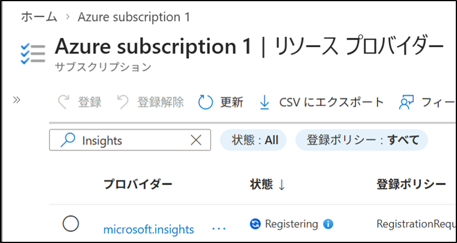
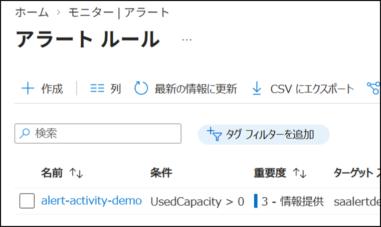
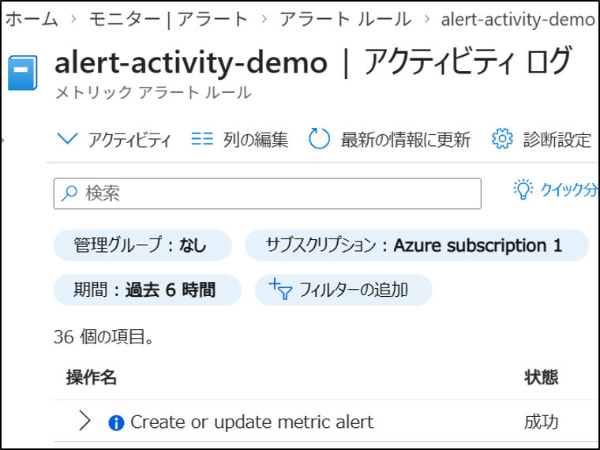
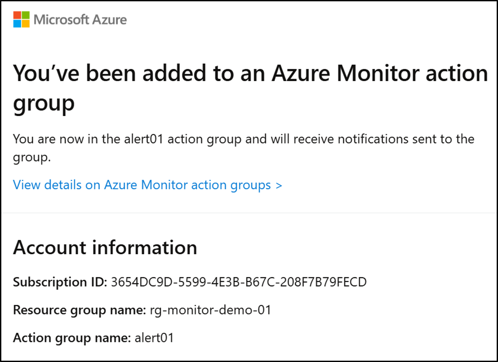

# Azure Monitor：アラートルール作成

## 1. 目的
Azure Monitor を使用して、仮想マシンを作成せずに利用可能なアラートルールを構築し、監視の基礎を理解する。**
（Microsoft Entra ID Free / Azure 無料枠で利用可能な範囲を確認済み）

## 2. 設計
- リソース：Azure Monitor（Log Analytics ワークスペース不要）
- アラート種別：**Activity Log アラート（リソースの操作イベントを監視）**
- 通知方法：アクション グループ（メール）

## 3. 手順（GUI）

### 3-1. 事前準備：Microsoft.Insights の登録
Azure Monitor のアラート機能を利用するためには、サブスクリプションで **Microsoft.Insights** を登録しておく必要がある。

1. 左メニュー → **サブスクリプション** を選択する。
2. 対象のサブスクリプションを開く。
3. 左メニュー → **設定** → **リソース プロバイダー** を選択する。
4. 検索欄に **insights** と入力する。
5. 一覧から **Microsoft.Insights** を選択し、状態が「未登録(NotRegistered)」の場合は **登録** を押す。
6. 数秒で「Registering」に変わることを確認する。

### 3-2. アラートルールの作成（Activity Log アラート）
Azure の操作ログ（Activity Log）を監視することで、  
リソースに対する設定変更・作成・削除などのイベントを検知できる。  
無料枠でも確実に利用できるため、本手順では Activity Log アラートを使用する。

1. 左メニュー → **監視** → **アラート** を選択する。
2. **作成** の下向き三角から **アラート ルール** を押す。
3. ＋作成をクリック
4. リソースを選択 → **適用** を押す。（今回はストレージアカウントを選択）
5. **条件タブ**をクリック
   - シグナル名：Used capacity
   - 値は：次の値より大きい
   - しきい値：0
6. **アクションタブ**をクリック
   - アクショングループ名：ag-monitor01（12文字以内）
   - 表示名：ag-monitor01（12文字以内）
   - メール：任意のメールアドレス
   - 保存をクリック
7. **詳細タブ**をクリック。
   - 重大度：3-情報
   - アラートルール名：alert-activity-demo
   - 説明：対象リソースの操作ログイベントを検知するアラート  
8. **確認および作成 → 作成** をクリック。

### 3-3. 動作確認
1. ストレージアカウントのコンテナにファイルをアップロードし、アラートを発生させる。
2. 監視→アラート→アラートルール→作成したアラートを選択
3. アクティビティログを選択、ログが表示されることを確認。
4. 設定したメールアドレスに、メール通知が届くことを確認。

## 4. 結果
- 仮想マシンを作成せずにアラートルールを構築できた。
- Azure Monitor のアラート構造（スコープ → 条件 → アクション）を理解した。

## 5. 学び
- Activity Log アラートはリソースの「操作ログ」を監視するため、無料枠でも利用できる。
- Azure Monitor は VM なしでも利用できるアラートが多数存在する。
- アクション グループを使うことで、通知方法を柔軟に設定できる。
