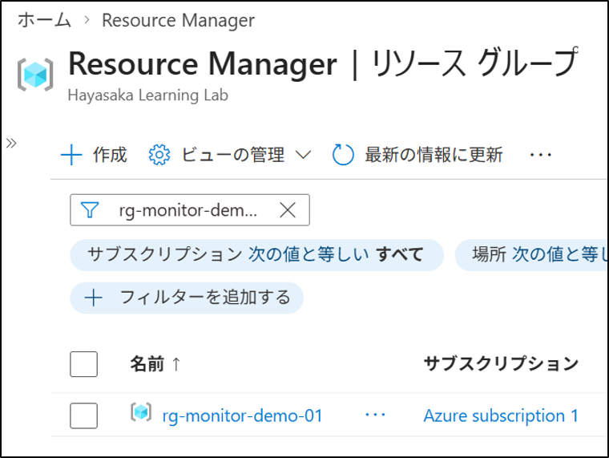
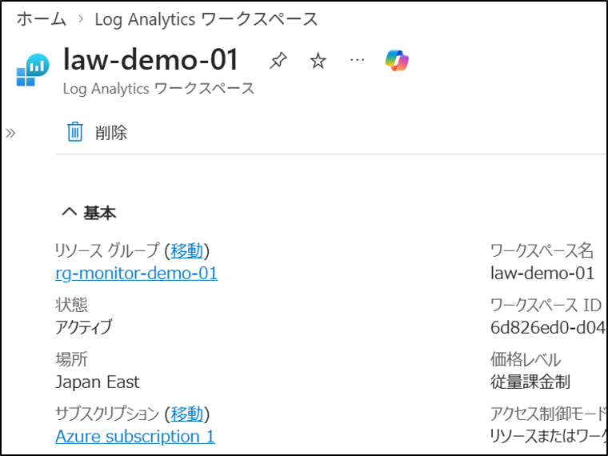

# Log Analytics ワークスペース作成

## 1. 目的
Azure Monitor の基盤となる **Log Analytics ワークスペース** を作成し、ログ収集の準備を整える。
現在のライセンス（Microsoft Entra ID Free）および **仮想マシンなし** の環境でも作成可能であることを確認する。

## 2. 設計
- リソース グループ：`rg-monitor-demo-01`
- ワークスペース名：`law-demo-01`
- リージョン：`Japan East`

## 3. 手順（GUI）
### 3-1. リソース グループの作成
1. Azure ポータルへサインインする。
2. 左メニュー → **リソース グループ**
3. **＋作成** を押す。
4. 以下を設定する：
   - サブスクリプション：`Azure subscription 1`
   - リソース グループ名：`rg-monitor-demo-01`
   - リージョン：`(Asia Pacific) Japan East`
5. **レビューと作成 → 作成**

### 3-2. Log Analytics ワークスペースの作成
1. 上部検索ウィンドウ → **Log Analytics ワークスペース**
2. **＋作成** を押す。
3. 以下を設定する：
   - サブスクリプション：`Azure subscription 1`
   - リソース グループ：`rg-monitor-demo-01`
   - 名前：`law-demo-01`
   - リージョン：`Japan East`
4. **レビューと作成 → 作成**

## 4. 結果
- Log Analytics ワークスペースが作成された。
- 仮想マシンなしの環境でも作成可能であることを確認した。
- Azure Monitor のログ収集基盤が整った。

## 5. 学び
- Log Analytics ワークスペースは Azure Monitor のログ基盤であり、各サービスのログを集約できる。
- 仮想マシンがなくても作成でき、Activity Log や Diagnostic Settings の送信先として利用できる。
- ワークスペースはリージョンとリソース グループの設計が重要である。