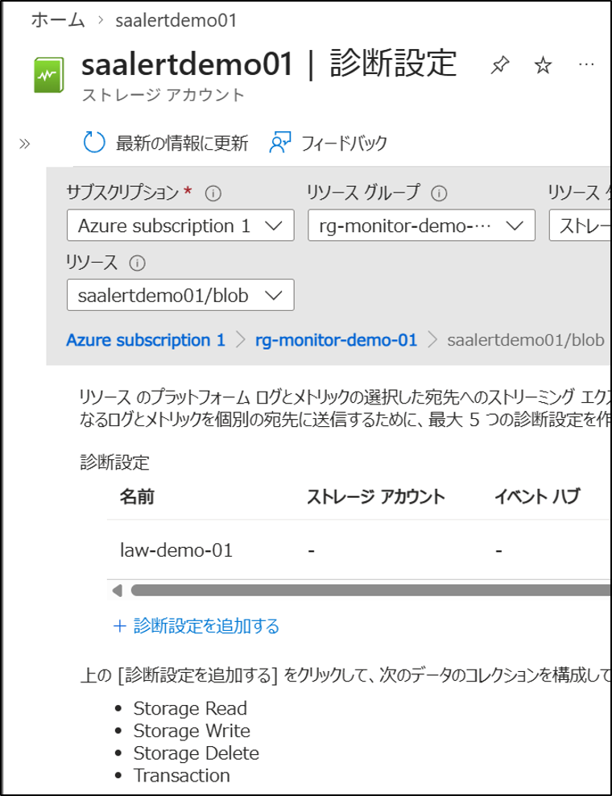
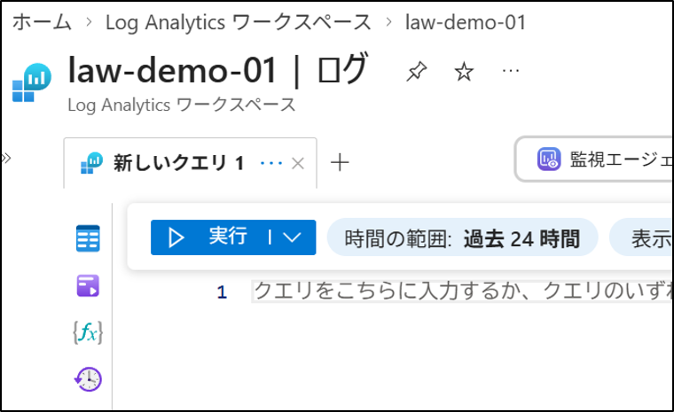
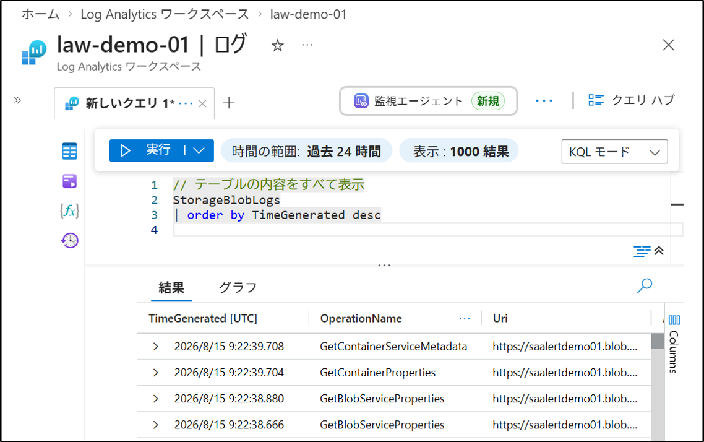
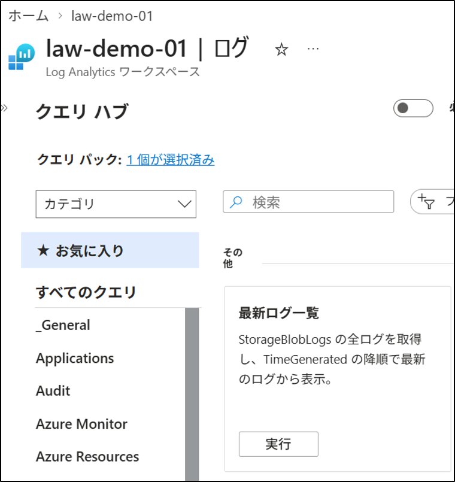

# KQL クエリ（基本）
## 1. 目的
Log Analytics ワークスペースで Kusto Query Language（KQL）の基本構文を理解し、ログデータを検索・抽出できるようにする。

## 2. 設計
- 使用サービス：Log Analytics ワークスペース
- 使用機能：ログ（Log）クエリ
- 学習範囲：検索、絞り込み、列抽出、並び替え

## 3. 手順（GUI）
### 3-1. 事前準備 ストレージアカウント診断設定
1. Azure ポータルにサインインする。
2. 左メニュー → ストレージアカウント → 対象のストレージアカウントを選択（例：`saalertdemo01`）
3. 左メニュー → **監視** → **診断設定**
4. **blob** を選択
5. **診断設定を追加** をクリック
6. 診断設定の名前：law-demo-01
7. 以下の項目にチェックを入れる
- **Storage Read**  
- **Storage Write**  
- **Storage Delete**
- **Log Analytics ワークスペースへの送信**
8. 保存をクリック



### 3-2. 事前準備 ログを発生させる
1. 左メニュー → ストレージアカウント → 対象のストレージアカウントを選択（例：`saalertdemo01`）
2. 左メニュー → データストレージ → コンテナー → 対象のコンテナーを選択（例：`container01`）
3. 任意のファイルで、アップロード、ダウンロード、削除を行う。


### 3-3. Log Analytics ワークスペースのログを開く
1. Azure ポータルにサインインする。
2. 上部検索ウィンドウ → **Log Analytics ワークスペース** を検索して選択。
3. 対象のワークスペースを開く。
4. 左メニュー → **ログ** を選択する。
(クエリ ハブ画面が表示される場合は、右上の?ボタンで閉じる)
5. 右上に **簡易モード** が表示される場合は、下向き三角から **KQLモード** を選択する。



### 3-4. 基本クエリの実行
```
// テーブルの内容をすべて表示
StorageBlobLogs
| order by TimeGenerated desc
```
```
// テーブルの行数を確認
StorageBlobLogs
| count
```
```
// 条件で絞り込み（指定したストレージアカウント・コンテナのログのみを表示）
StorageBlobLogs
| where AccountName == "saalertdemo01"
| where ContainerName == "container01"
```
```
// 必要な列だけを抽出
StorageBlobLogs
| project TimeGenerated, OperationName, StatusCode, Uri, CallerIpAddress
```
```
// 並び替え（最新のデータが上に来るように並び替える。）
StorageBlobLogs
| order by TimeGenerated desc
```
```
// アップロード操作のみを抽出
StorageBlobLogs
| where OperationName == "PutBlob"
| order by TimeGenerated desc
```
```
// ダウンロード操作のみを抽出
StorageBlobLogs
| where OperationName == "GetBlob"
| order by TimeGenerated desc
```
```
// 削除操作のみを抽出
StorageBlobLogs
| where OperationName == "DeleteBlob"
| order by TimeGenerated desc
```



### 3-5. クエリ（検索条件）の保存と呼び出し
1. クエリ編集画面右上の **保存** → **クエリとして保存**を押す。
2. 任意の名前を入力し保存する。
3. 開くときは、画面右上の **クエリハブ** → 任意のクエリを選択
（下の方にある場合は、画面をスクロールする）



### 3-6. 確認：見るべき項目と意味
- TimeGenerated：操作が実行された日時
- OperationName：実行された Blob 操作の種類
- StatusCode：成功／失敗（200/201=成功、404=なし、403=権限不足）
- Uri：対象 Blob のパス
- CallerIpAddress：操作を実行した端末の IP

### 3-7. 確認：OperationName の種類と意味
- PutBlob：Blob のアップロード
- GetBlob：Blob のダウンロード
- DeleteBlob：Blob の削除
- GetBlobProperties：Blob のプロパティ取得
- GetBlobMetadata：Blob のメタデータ取得
- BlobPreflightRequest：操作前の事前チェック
- GetContainerProperties：コンテナ情報の取得
- GetBlobTags：Blob タグの取得

## 4. 結果
- Log Analytics ワークスペースで基本的な KQL クエリを実行できた。
- 検索、絞り込み、列抽出、並び替えの基本構文を理解した。
- クエリの保存方法を習得した。

## 5. 学び
- KQL はログ分析に特化した構文であり、パイプ（`|`）で処理をつなげていく形式が特徴である。
- 基本構文を組み合わせることで、必要なログ情報を効率的に抽出できる。