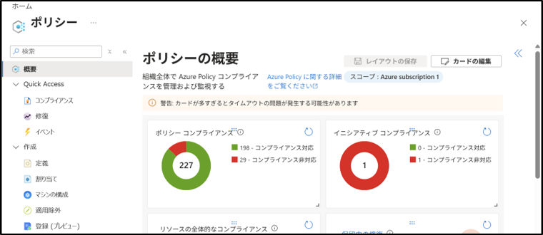
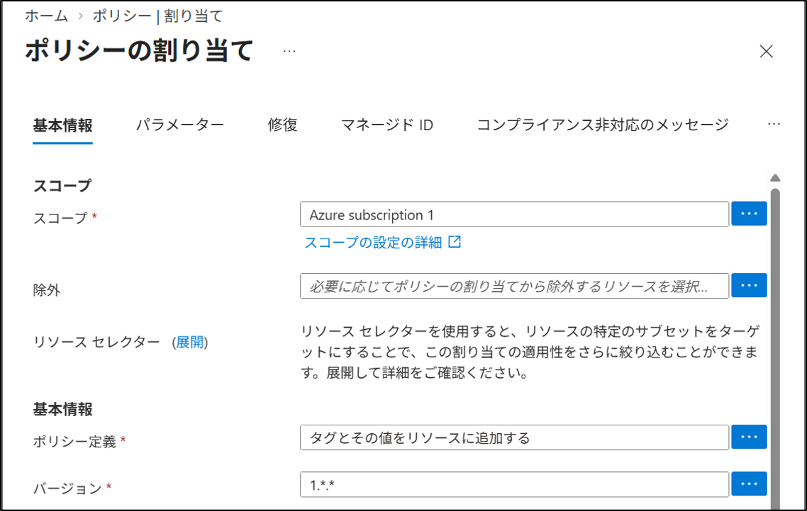
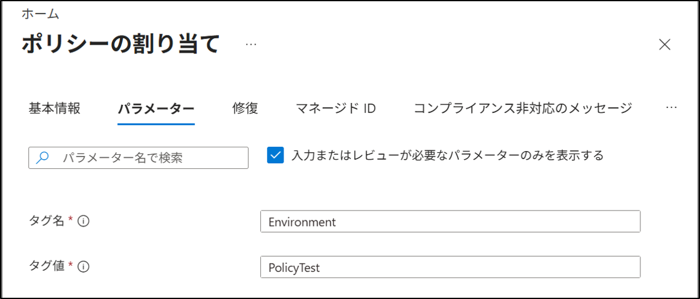
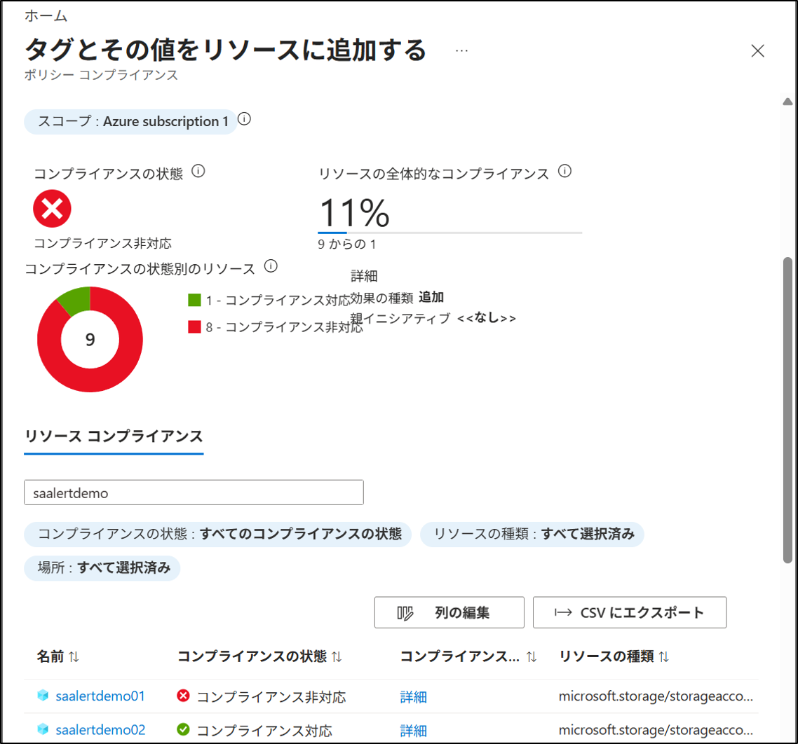

# Azure Policy：割り当て
## 1. 目的
Azure Policy を使用し、サブスクリプションまたはリソース グループに対してポリシーを割り当てる手順を理解する。

## 2. 設計
- 対象スコープ：任意のリソース グループ
- 割り当てるポリシー：組み込みポリシー（例：タグの強制、場所の制限など）
- 割り当て方法：Azure ポータル（GUI）

## 3. 手順
### 3-1. Azure Policy 画面を開く
1. Azure ポータルへサインインする。
2. 画面上検索窓で検索 → **ポリシー** を選択する。
3. 「概要」画面が表示される。

### 3-2. ポリシー割り当ての開始、スコープの設定
1. 左メニュー → **作成** → **割り当て** を選択する。
2. 上部の **ポリシーの割り当て** を押す。
3. **基本情報タブ** → **スコープ** → **・・・** をクリック。
4. 任意のサブスクリプションを選択。（例：Azure subscription 1）
5. 任意のリソース グループを選択。（省略可）
6. **選択** をクリック。

### 3-3. ポリシー定義の選択
1. **ポリシー定義** → **・・・** をクリック。
2. 一覧から組み込みポリシーを選択。（例：`Append a tag and its value to resources`）
   （選択できるポリシーは1つだけです）
3. **追加** をクリック。
「Append a tag and its value to resources」は、新規作成したリソースにタグを自動的に付けるポリシー。既存のリソースには影響しない。

### 3-4. 割り当て名の設定
1. 「割り当て名」を入力。（自動で入力される場合もある）
2. 説明が必要な場合は任意で入力。
3. **レビューと作成** → **作成** をクリック。

### 3-5. パラメーターの設定
1. パラメータータブを選択
2. 選択したポリシーに応じて、必要なパラメーターを入力する。パラメーターは、ポリシーによって異なる。
   - タグ名：Environment
   - タグ値：PolicyTest
3. 入力後、**レビューと作成** → **作成** を押す。

### 3-7. 割り当て結果の確認
1. 左メニュー → **Quick Access** → **コンプライアンス** を選択する。
2. 作成したポリシーを選択（今回は、タグとその値をリソースに追加する）
3. 画面を下までスクロールし、「コンプライアンスの状態」を確認する。
（既存のリソース **saalertdemo01** にはポリシーが適用されておらず、新規作成した **saalertdemo02** にはポリシーが適用されている）
（コンプライアンスの反映には数十分かかります）

## 4. 結果
- 対象スコープにポリシーが割り当てられた。
- パラメーターが設定された状態でポリシーが適用される。
- コンプライアンス画面で評価結果を確認できる。

## 5. 学び
- Azure Policy の割り当て手順を理解した。
- スコープ → ポリシー定義 → パラメーター → 割り当て の流れを把握した。
- ガバナンス構成の基礎として、ポリシー適用の重要性を理解した。