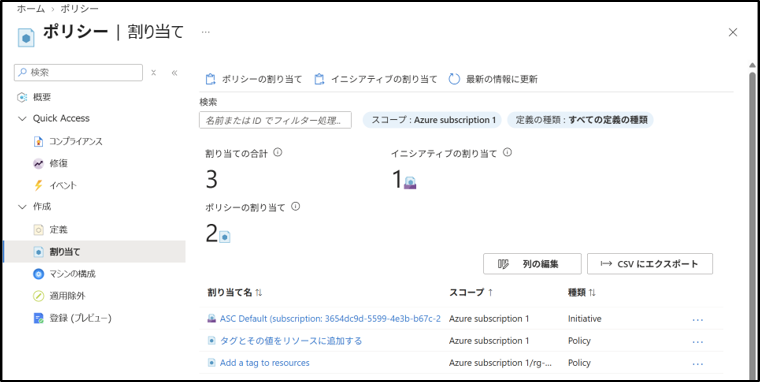
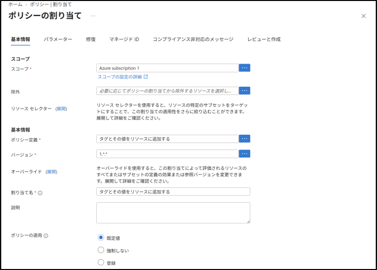
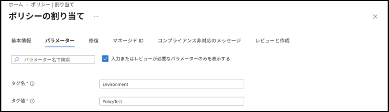

# Azure Policy：割り当て
## 1. 目的
Azure Policy を使用し、サブスクリプションまたはリソース グループに対してポリシーを割り当てる手順を理解する。

## 2. 設計
- 対象スコープ：任意のリソース グループ
- 割り当てるポリシー：組み込みポリシー
- 割り当て方法：Azure ポータル

## 3. 手順
### 3-1. Azure Policy 画面を開く
1. Azure ポータルにサインイン。
2. 上部検索バーから、"ポリシー"を検索してクリック。

### 3-2. ポリシー割り当ての開始
1. 左メニュー → 「作成」→「割り当て」を選択。
2. 上部の「ポリシーの割り当て」を押す。

### 3-3. 基本情報タブ（スコープ、基本情報）
1. 「基本情報タブ」→「スコープ」→「...」をクリック。
2. 「サブスクリプション」で `Azure subscription 1` を選択。
3. 「選択」をクリック。
4. 「ポリシー定義」→「...」をクリック。
5. 一覧から `Append a tag and its value to resources` を検索して選択。
   （選択できるポリシーは1つだけです）
6. 「追加」をクリック。
`Append a tag and its value to resources` は、新規作成したリソースにタグを自動的に付けるポリシー。既存のリソースには影響しない。
7. 「割り当て名」に `タグとその値をリソースに追加する` を入力。（自動で入力される場合もある）
8. 「レビューと作成」→「作成」をクリック。

### 3-4. パラメーターの設定
1. パラメータータブを選択
2. 選択したポリシーに応じて、必要なパラメーターを入力する。パラメーターは、ポリシーによって異なる。
   - タグ名：`Environment`
   - タグ値：`PolicyTest`
3. レビューと作成 → 作成 をクリック。

## 4. 結果
- 対象スコープにポリシーが割り当てられた。
- パラメーターが設定された状態でポリシーが適用される。

## 5. 学び
- Azure Policy の割り当て手順を理解した。
- スコープ → ポリシー定義 → パラメーター → 割り当て の流れを把握した。
- ガバナンス構成の基礎として、ポリシー適用の重要性を理解した。