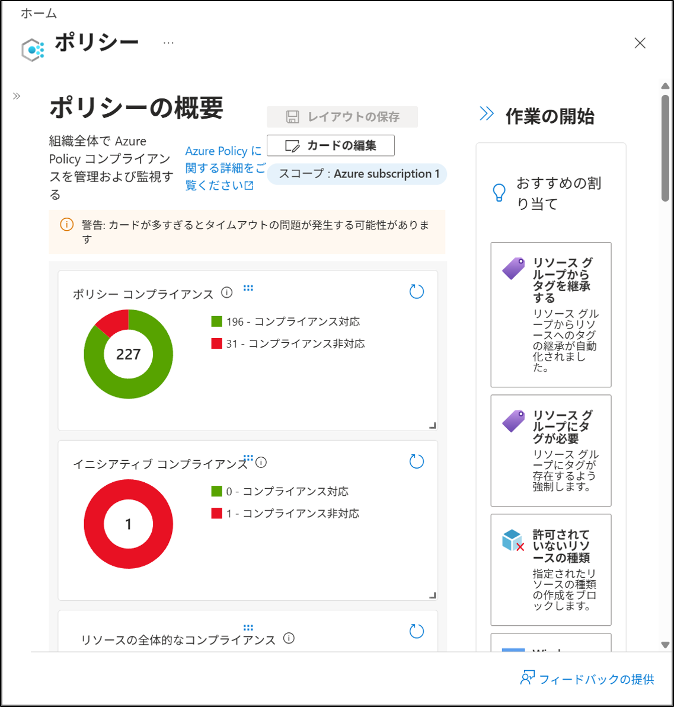

# Compliance の確認
## 1. 目的
Azure Policy を割り当てた後、対象リソースがポリシーに準拠しているかを確認する。  
Compliance 画面から、リソースが 対応/非対応 のどちらに分類されたかを確認する。

## 2. 設計
- 対象 Policy  
  - Environment タグの設定を要求するポリシー  
- Assignment  
  - リソース グループ単位で割り当て  
- 評価対象  
  - 仮想マシン以外のリソース（課金なし）

## 3. 手順
### 3-1. Azure Portal へアクセス
1. Azure Portal にサインインする。  
2. 左メニューから **ポリシー** を選択する。

### 3-2. Compliance の確認
1. 左メニュー → **Quick Access** → **コンプライアンス** を選択する。  
2. 割り当て済みの Policy Assignment が一覧で表示される。  
3. 対象の Policy Assignment をクリックする。（例：タグとその値をリソースに追加する）
4. 画面を下までスクロールし、「コンプライアンスの状態（対応/非対応）」を確認する。
（既存のリソース **saalertdemo01** にはポリシーが適用されておらず、新規作成した **saalertdemo02** にはポリシーが適用されている）
（コンプライアンスの反映には数十分かかります）

## 4. 結果
- Policy の評価結果が表示され、対象リソースの準拠状況を確認できた。  
- Compliant のリソースは、Environment タグが設定されていることを確認した。  
- Non-compliant のリソースは、タグが未設定であることを確認した。

## 5. 学び
- Policy の割り当て後は、Compliance 画面で評価結果を確認できる。  
- Compliant / Non-compliant により、リソースの準拠状況を一目で把握できる。  
- 非準拠リソースは次のステップで対応する必要がある。