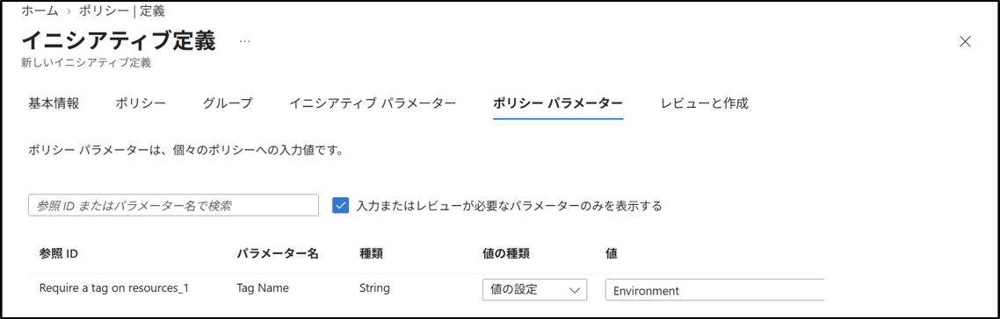
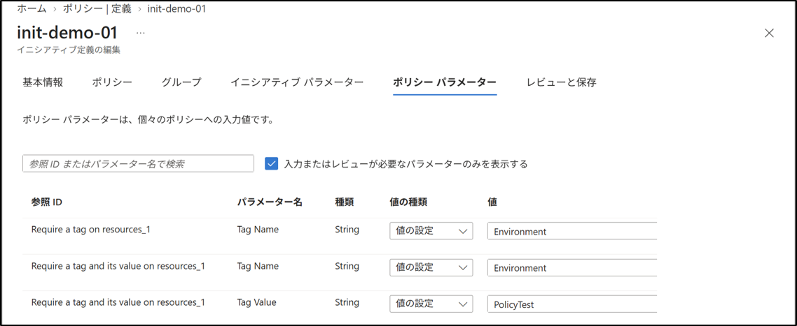
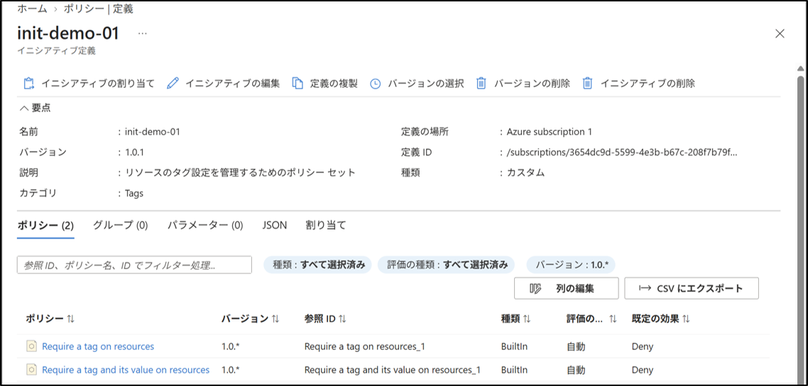
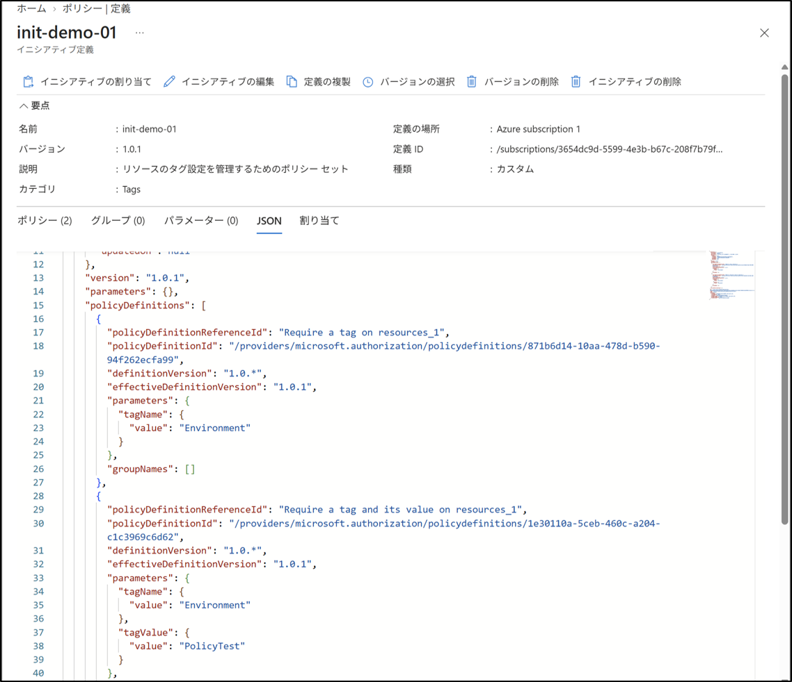

# Azure Policy：Initiative 作成
## 1. 目的
複数のポリシーをまとめて管理するため、Initiative（ポリシー セット）を作成する手順を記載する。

## 2. 設計
- Initiative 名：`init-demo-01`
- 定義の場所：`Azure subscription 1`
- カテゴリ：任意
- 追加するポリシー：
  - `Require a tag on resources`
  - `Require a tag and its value on resources`

## 3. 手順
### 3-1. Azure Policy 画面へ移動
1. Azure ポータルにサインイン。
2. 上部検索バーから、"ポリシー"を検索してクリック。

### 3-2. Initiative（ポリシー セット）の作成開始
1. 左メニューから 作成 → 定義 をクリック。
2. ＋イニシアティブ定義をクリック。

### 3-3. 基本情報の入力
1. 「定義の場所」の右にある「...」をクリック。
2. 「サブスクリプション」で `Azure subscription 1` を選択。
3. 「選択」をクリック。
4. 「名前」に `init-demo-01` を入力。
5. 「説明」に以下を入力。
   `リソースのタグ設定を管理するためのポリシー セット`
6. 「カテゴリ」は "新規作成" を選択し、`Tags` を入力。

### 3-4. ポリシーの追加（1つ目）
1. ポリシータグをクリック
2. 「ポリシー定義の追加」をクリック。
3. 一覧から `Require a tag on resources` を選択。（タグ名の設定を必須にするポリシー）
4. 「追加」をクリック。

> **注意**
> ここで２つ以上のポリシーを追加してもよいが、「タグ名」という同じ名前のパラメーターが重複してエラーが発生する場合がある。
> １つ目のポリシーだけでイニシアティブを作成し、あとから編集で２つ目を追加するとエラーを回避できる。

### 3-5. パラメーター設定と作成
追加したポリシーにパラメーターがある場合は、必要な値を設定する。今回は、タグ名を `Environment` とする。

1. 「ポリシー パラメーター」タブをクリック。
2. `Require a tag on resources` のTag Nameの値に `Environment` を入力。
3. 「レビューと作成」→「作成」をクリック。

### 3-6. 2つ目のポリシーの追加
作成済みの `init-demo-01` に、`Require a tag and its value on resources` を追加する。

1. ポリシー画面の左メニューから 作成 → 定義 をクリック。
2. 定義一覧から `init-demo-01` を検索してクリック。
3. 「イニシアティブの編集」をクリック。
4. 「基本情報」タブで、新しいバージョンに `1.0.1` を入力
5. 「ポリシー」タブで「ポリシー定義の追加」をクリック。
6. 一覧から `Require a tag and its value on resources` を検索し、選択して「追加」をクリック。（タグ名とタグ値の設定を必須にするポリシー）
7. 「ポリシー パラメーター」タブで、`Require a tag and its value on resources` のTag Nameの値に `Environment`、Tag Valueの値に `PolicyTest` を入力。
8. 「レビューと作成」→「保存」をクリック。

### 3-7. 作成結果の確認
1. ポリシー画面の左メニューから 作成 → 定義 をクリック。
2. 定義一覧から `init-demo-01` を検索してクリック。
3. 「ポリシー」タブをクリックし、`Require a tag on resources`・`Require a tag and its value on resources` が表示されていることを確認する。
4. 「JSON」タブから、`tagName`・`tagValue` の値が正しく設定されていることを確認。

## 4. 結果
- `init-demo-01` という Initiative（ポリシー セット）を作成した。
- `Require a tag on resources` を1つだけ追加して作成した後、編集で `Require a tag and its value on resources` を追加する、という2段階の手順で作成した。
- Initiative が「定義」一覧に表示され、JSON上で `tagName`・`tagValue` の値が正しく反映されていることを確認した。

## 5. 学び
- Initiative により、複数のポリシーを一つの単位として割り当てられることを理解した。
- 同じ名前のパラメーター（今回は「タグ名」）を持つ複数のポリシーを同時に追加すると、エラーが発生する場合があると分かった。
- その場合、ポリシーを1つずつ追加することでエラーを回避できることを学んだ。
