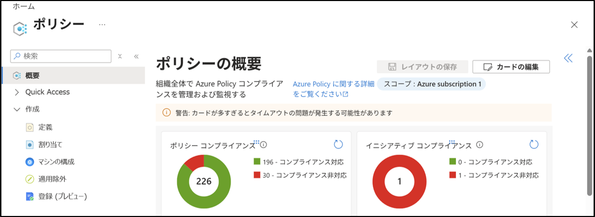
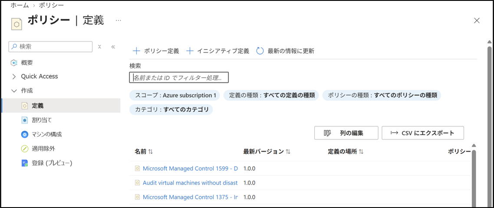
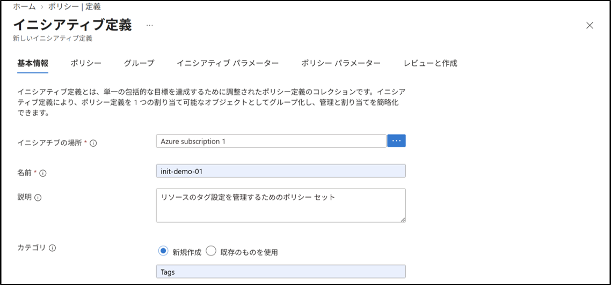
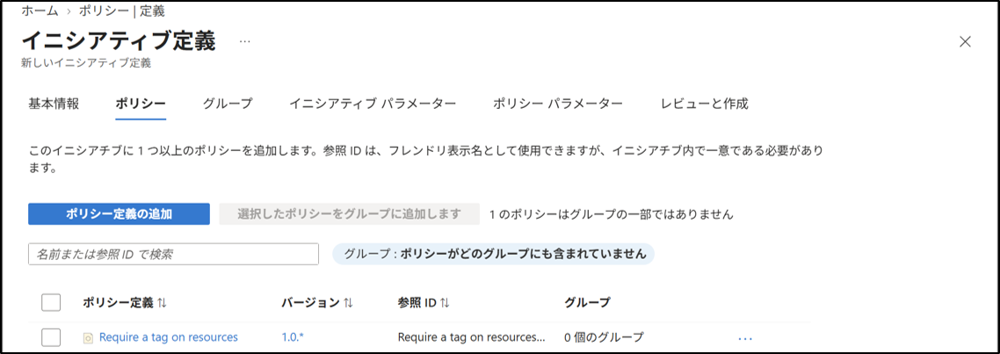

# Azure Policy：Initiative 作成

## 1. 目的
複数のポリシーをまとめて管理するため、Initiative（ポリシー セット）を作成する手順を記載する。

## 2. 設計
- Initiative 名：`init-demo-01`
- 定義の場所：`Azure subscription 1`
- カテゴリ：任意
- 追加するポリシー：
  - `Require a tag on resources`
  - `Require a tag and its value on resources`

Initiative は、複数のポリシー定義を一つにまとめて管理するための仕組みである。今回は、リソースのタグ設定に関する 2 つのポリシーをまとめる。

## 3. 手順

### 3-1. Azure Policy 画面へ移動
1. Azure ポータルにサインインする。
2. 左メニューから「Policy」をクリックする。

### 3-2. Initiative（ポリシー セット）の作成開始
1. 左メニューから「作成」を選択する。
2. 「定義」をクリックする。
3. 上部の「ポリシー セット定義」をクリックする。

### 3-3. 基本情報の入力
1. 「定義の場所」を選択する。
2. 「サブスクリプション」で `Azure subscription 1` を選択する。
3. 「名前」に `init-demo-01` を入力する。
4. 「説明」に以下を入力する。
   `リソースのタグ設定を管理するためのポリシー セット`
5. 「カテゴリ」を選択する。
6. 「次へ」をクリックする。

### 3-4. ポリシーの追加
1. 「ポリシーの追加」をクリックする。
2. 一覧から `Require a tag on resources` を選択する。
3. 「追加」をクリックする。
4. 再度「ポリシーの追加」をクリックする。
5. 一覧から `Require a tag and its value on resources` を選択する。
6. 「追加」をクリックする。

追加したポリシーが一覧に表示されていることを確認する。

### 3-5. パラメーター設定
追加したポリシーにパラメーターがある場合は、ポリシーごとに必要な値を設定する。今回は、タグ名を `Environment`、タグ値を `PolicyTest` とする。

1. 「ポリシー パラメーター」をクリックする。
2. `Require a tag on resources` のタグ名に `Environment` を入力する。
3. `Require a tag and its value on resources` のタグ名に `Environment` を入力する。
4. タグの値に `PolicyTest` を入力する。
5. 「次へ」をクリックする。

### 3-6. グループの設定
1. 「グループ」をクリックする。
2. 今回はグループ分けを行わないため、そのまま「次へ」をクリックする。

### 3-7. 確認と作成
1. 「レビューと作成」をクリックする。
2. 「定義の場所」が `Azure subscription 1` になっていることを確認する。
3. 「名前」が `init-demo-01` になっていることを確認する。
4. 追加したポリシーが一覧に表示されていることを確認する。
5. パラメーターに `Environment` と `PolicyTest` が設定されていることを確認する。
6. 「作成」をクリックする。

### 3-8. 作成結果の確認
1. 作成が完了したら「定義」をクリックする。
2. 定義一覧から `init-demo-01` を検索する。
3. `init-demo-01` が一覧に表示されていることを確認する。
4. `init-demo-01` をクリックする。
5. Initiative に追加したポリシーが表示されていることを確認する。

## 4. 結果
- `init-demo-01` という Initiative（ポリシー セット）を作成した。
- Initiative が「定義」一覧に表示されていることを確認した。
- `Require a tag on resources` と `Require a tag and its value on resources` を一つの Initiative にまとめた。
- Initiative に含めるポリシーのパラメーターを設定した。

## 5. 学び
- Initiative（ポリシー セット）を使用して、複数のポリシーをまとめて管理する方法を理解した。
- Initiative により、複数のポリシーを一つの単位として割り当てられることを理解した。
- Initiative 作成時に、ポリシーの追加やパラメーターの設定を行えることを理解した。
- 関連するポリシーをまとめてガバナンスを構成できることを理解した。