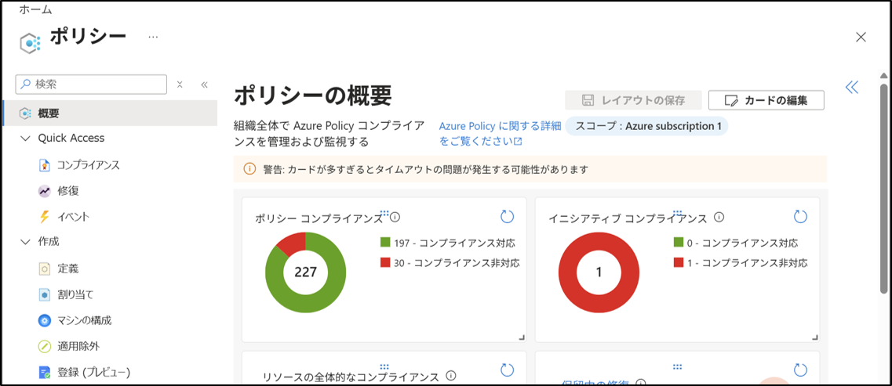
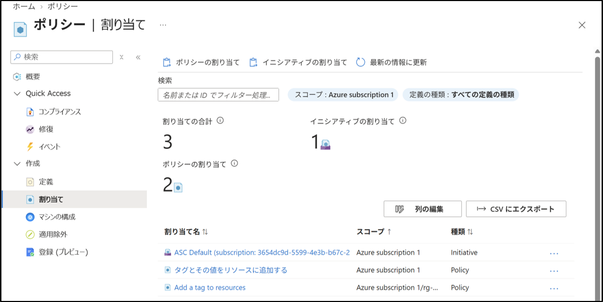
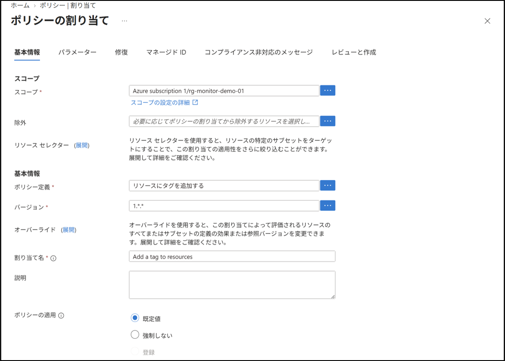
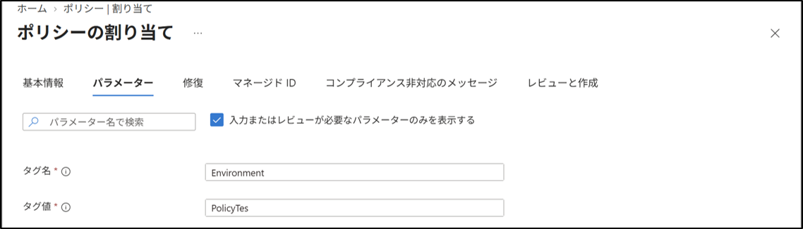
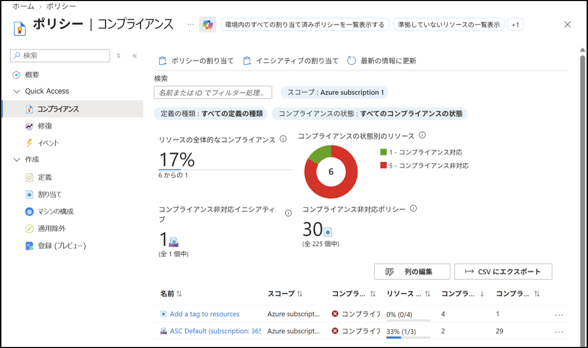
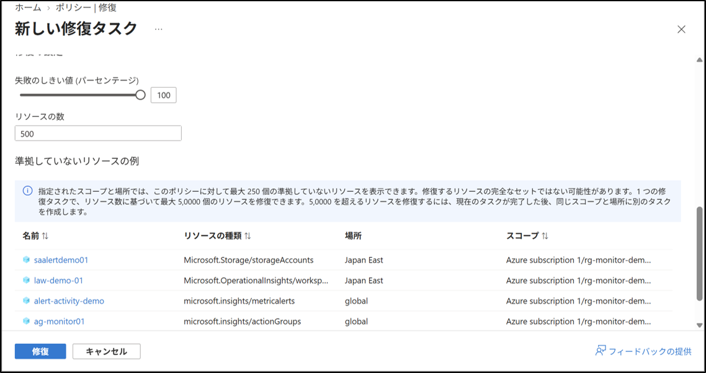
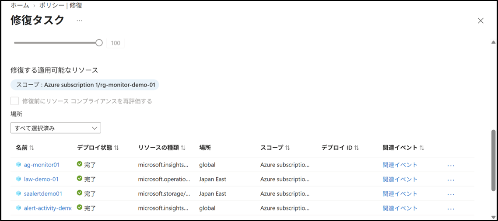
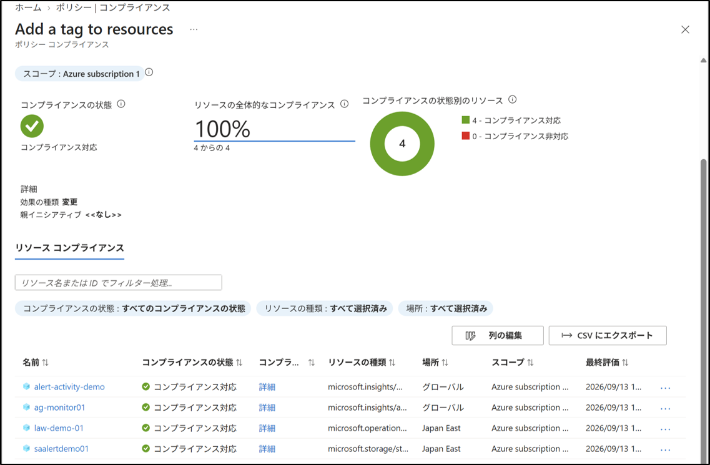

# Azure Policy：Non-compliant リソースの特定・是正
## 1. 目的
Azure Policy のコンプライアンス評価で非対応と判定された既存リソースを特定し、修復タスクを使用して是正する手順を理解する。

## 2. 設計
- 対象ポリシー：`Add a tag to resources`（組み込みポリシー、Modify効果）
- 割り当てスコープ：リソース グループ `rg-monitor-demo-01`（非対応リソース `saalertdemo01` が所属）
- 対象リソース：Environmentタグが未設定の既存リソース（仮想マシン以外、課金なし）
- 是正方法：Azure ポータルの修復機能（修復タスク）

> **注意**
> 04-01で使用した `Append a tag and its value to resources` はAppend効果のポリシーであり、新規作成・更新時のみ適用されるため、既存の非対応リソースを修復タスクで是正することができない。
> 既存リソースを是正するには、Modify効果またはDeployIfNotExists効果を持つポリシーが必要となるため、今回は `Add a tag to resources` を新たに割り当てる。

## 3. 手順
### 3-1. Azure Policy 画面へ移動
1. Azure ポータルにサインイン。
2. 上部検索バーから、"ポリシー"を検索してクリック。

### 3-2. Modify効果を持つポリシーの割り当ての開始
1. 左メニューから 作成 → 割り当て をクリック。
2. 上部の ポリシーの割り当て をクリック。

### 3-3. 基本情報タブ（スコープの設定、ポリシー定義の割り当て）
1. 基本情報タブ → スコープ →「...」をクリック。
2. 「サブスクリプション」で `Azure subscription 1` を選択。
3. 「リソース グループ」で `rg-monitor-demo-01`（`saalertdemo01` が所属する非対応リソースを含むリソース グループ）を選択。
4. 選択をクリック。
5. ポリシー定義 →「...」をクリック。
6. 一覧から `Add a tag to resources` を検索して選択。
7. 追加をクリック。
8. 割り当て名に `Add a tag to resources` を入力。

### 3-4. パラメータータブ（タグ名、タグ値の設定）
1. パラメータータブを選択。
2. タグ名の値に `Environment` を入力。
3. タグ値の値に `PolicyTest` を入力。
4. レビューと作成 → 作成 をクリック。

### 3-5. コンプライアンス画面で非対応リソースを特定
1. 左メニューから コンプライアンス をクリック。
2. 割り当てた `Add a tag to resources` をクリック。
3. リソース コンプライアンスの一覧で、状態が 非対応 のリソースを確認。
（対象のリソース `saalertdemo01` にEnvironmentタグが設定されていないため、非対応と判定されている）
（コンプライアンスの反映には数十分かかる場合がある。反映が遅い場合は、Cloud Shellから `az policy state trigger-scan --resource-group "rg-monitor-demo-01"` を実行して評価を更新する）

### 3-6. 修復タスクの作成
1. 左メニューから 修復 をクリック。
2. 修復するポリシー タブで、対象の `Add a tag to resources` をクリック。
3. 「新しい修復タスクの作成」画面で、対象のリソースの一覧を確認。（表示されていない場合は画面下までスクロールする）
4. 修復をクリック。

### 3-7. 修復タスクの進捗確認
1. 修復タスク タブをクリック。
2. 作成したタスクをクリック。
3. 状態が 実行中 から 完了 に変わることを確認。
4. 対象のリソースの一覧で、各リソースの修復結果を確認。
（修復には数分かかる。切り替わらない場合はブラウザを更新して確認する）

### 3-8. 是正結果の確認
1. 左メニューから コンプライアンス をクリック。
2. 割り当てた `Add a tag to resources` をクリック。
3. 是正したリソースのコンプライアンスの状態が 対応 に変わっていることを確認。
（コンプライアンスの反映には数十分かかる場合がある。反映が遅い場合は、Cloud Shellから `az policy state trigger-scan --resource-group "rg-monitor-demo-01"` を実行して評価を更新する）

## 4. 結果
- コンプライアンス画面から、Environmentタグが未設定の非対応リソースを特定できた。
- Modify効果を持つポリシー `Add a tag to resources` を割り当てたとき、修復タスクを実行することで、既存の非対応リソースにタグを追加し是正できた。（Modify効果は、これから作成するリソースにしか適用されないため、すでに存在するリソースには、修復を使って適用する）
- 是正後、対象リソースのコンプライアンスの状態が対応に変わったことを確認した。

## 5. 学び
- 修復タスクはModify効果またはDeployIfNotExists効果を持つポリシーでのみ利用でき、AppendやDeny効果のポリシーでは既存リソースを是正できない。
- コンプライアンス画面で非対応リソースを特定した後、修復 画面から手動で修復タスクを作成する必要があることを理解した。
- 修復タスクの実行結果や、コンプライアンスの再評価には反映までにタイムラグがあるため、結果確認は時間を置いて行う必要があると学んだ。

## 補足：今回関係するポリシー効果（Effect）
- Append：リソースの作成・更新時にのみ、指定したプロパティ（タグなど）を追加する。すでに存在するリソースには適用されない。
- Modify：リソースの作成・更新時にプロパティを追加・変更・削除できるほか、修復タスクを使うことで、すでに存在するリソースにも後から適用できる。
- Deny：ポリシーの条件を満たさないリソースの作成・更新をブロックする。
