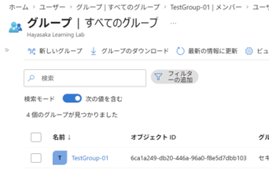
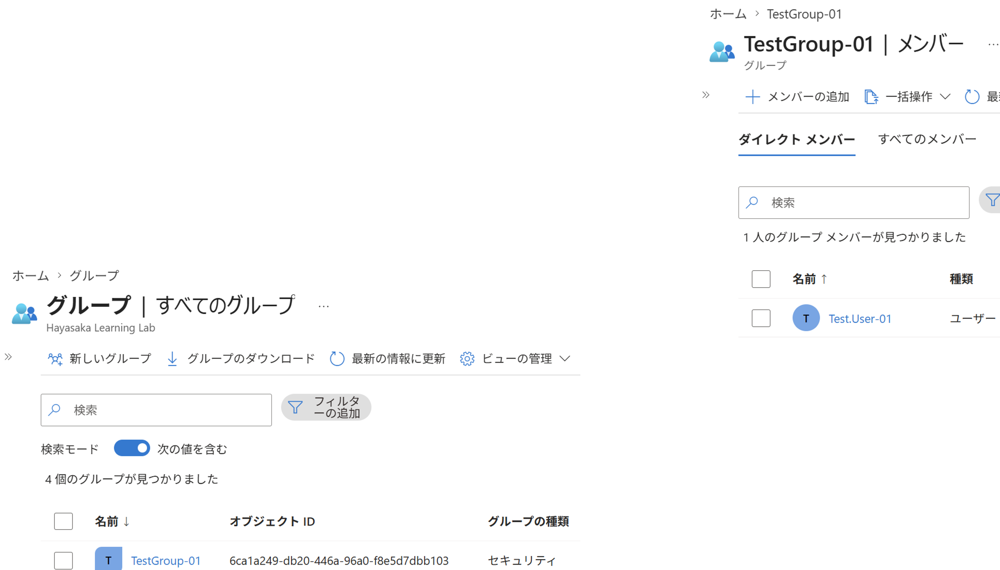
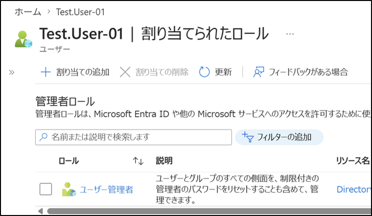

# **Entra ID：ユーザー・グループ・ロール管理（GUI）**

## 1. 目的
Entra ID 上で以下の 4 要素を一連の流れとして理解する。  
- ユーザー作成  
- グループ作成  
- ユーザーのグループ紐づけ  
- ロール（権限）付与  
---

## 2. 設計（What）
- ユーザー  
  - Test.User-01
- グループ  
  - TestGroup-01
- 紐づけ  
  - Test.User-01 → TestGroup-01
- ロール
  - Test.User-01 → User Administrator
---

## 3. 手順（How：GUI）
### 3-1. ユーザーの作成
1. Microsoft Entra 管理センターへアクセス
2. **ユーザー → 新しいユーザー**を選択 
3. 必要項目を入力し作成
---

---
### 3-2. グループの作成
1. **グループ → 新しいグループ** を選択  
2. **グループの種類：セキュリティ** を選択  
3. **グループ名**を入力し作成
---

---
### 3-3. グループにメンバーを追加する
1. **グループ → 全てのグループ → 対象のグループ** を選択  
2. **メンバー → メンバーの追加** を選択  
3. **作成したユーザー**を追加
---

---
### 3-4. ユーザーにロールを割り当てる
1. Microsoft Entra 管理センターへアクセス  
2. **ユーザー → 対象のユーザー** を選択  
3. **割り当てられたロール** を選択  
4. **割り当ての追加** を選択  
5. 付与するロール（User Administrator）を選択し追加
---

---
## 5. 結果（Output）
- ユーザーが作成されている  
- グループが作成されている  
- グループにユーザーが所属している  
- ユーザーにロールが付与されている

## 6. 学び（Insight）
- GUI操作によるユーザー／グループ管理の流れを理解した
- ユーザー → グループ → ロール の階層構造を把握した
- ID管理の基礎 4 要素を一連の操作として整理した
