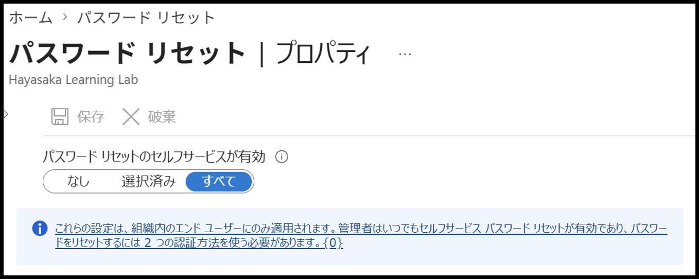
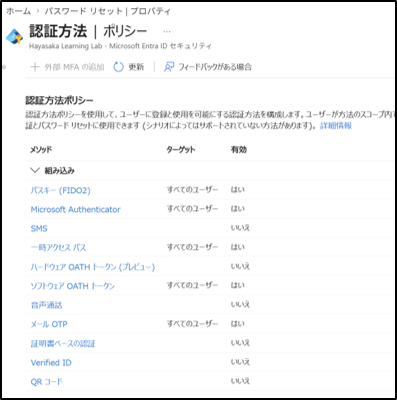
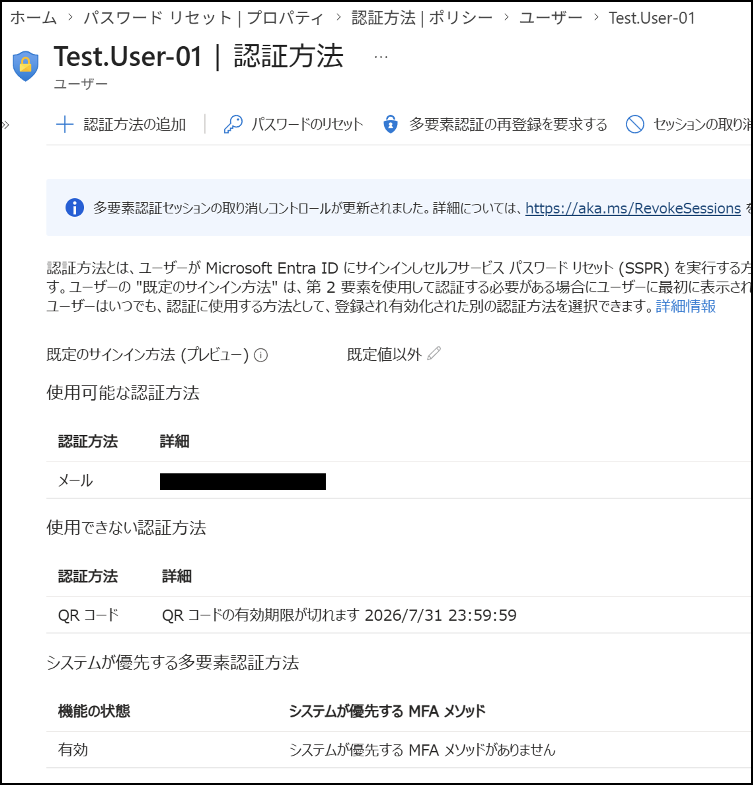
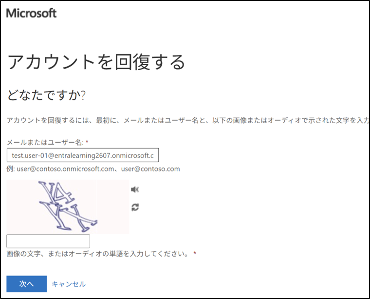

# **SSPR（Self-Service Password Reset）**

## 1. 目的  
ユーザー自身がパスワードをリセットできるようにするため、
Entra ID の **自己サービス パスワード リセット（SSPR）** を有効化し、
認証方法の登録と動作確認を行う。

## 2. 設計  
- 対象ユーザー  
  - Test.User-01  
- 有効化する機能  
  - Self-Service Password Reset（SSPR）  
- 必要な認証方法  
  - QRコード（Microsoft Authenticator）  
  - メール OTP

## 3. 手順（GUI）
### 3-1. SSPR の有効化  
1. Microsoft Entra 管理センターへアクセス
2. **パスワード リセット** を選択  
3. **プロパティ → 自己サービス パスワード リセットを有効化**  
4. 対象：**すべてのユーザー**

### 3-2. 認証方法ポリシーの確認  
1. **認証方法 → ポリシー**  
2. 有効化されている認証方法を確認  
   - Microsoft Authenticator：はい  
   - メール OTP：はい  
   - 一時アクセスパス：はい  

### 3-3. ユーザー側：認証方法の登録  
1. **ユーザー → Test.User-01**  
2. **認証方法** を開く  
3. **認証方法の追加**  
4. QRコード（Microsoft Authenticator） / メール OTP を登録

### 3-4. SSPR の動作確認  
1. サインイン画面で **「パスワードを忘れた場合」** を選択  
2. 登録済みの認証方法で本人確認  
3. 新しいパスワードを設定  
4. 正常にサインインできることを確認

## 4. 結果  
- SSPR が有効化されている
- Test.User-01 が認証方法を登録済み
- パスワードリセットがユーザー自身で可能になった

## 5. 学び  
- SSPR は「認証方法の登録」が必須  
- 管理者設定（パスワード リセット）とユーザー設定（認証方法）の **二段階構造**  
- 認証方法ポリシーと SSPR の関係性を理解した  
